# Understanding the logic of Revenue Margin Analysis with a simple example

## Case Study Overview:

We have three products: A, B and C. They are undergoing changes in price, cost and quantity over 2 years; therefore, our revenue margin has changed. Our goal is to answer following questions: 
1. What are the **driving factors** in the revenue margin change? 
2. What is the **product mix effect** and how has each product performed with regards to the product mix? 
3. Looking at **each product itself**, how has it performed at an operational level?

Here, we provide an analytical framework which consists of two perspectives: top level view which we call **Volume-Mix-Margin Perspective (VMM)** and line level view which we call **Price-Cost-Quantity Perspective (PCQ)**. First, why two instead of one? We **cannot answer all questions with one view**. When we analyze the mix effect using VMM and focus on the overall product structure, we cannot dive into each product for detailed factor analysis. Vice versa with the PCQ, mix effects will be embedded in each factor and cannot be separately determined. 

## Let's start with the Volume-Mix-Margin Perspective (VMM)

On the global perspective, we can just **consider margin (price – cost) and quantity in a two-factor analysis**, how can we break the total revenue margin change of 360 into different drivers? By **controlling variables step by step**. Let's take product A as an example: 

Starting with FY24 Revenue Margin of 100, if we assume **only quantity changes**, while **margin and quantity share remain FY24 level (thus no product structure change)**, how much more revenue margin can we have?

### Volume Effect

**Volume Effect** = ( FY25 Total Quantity (F12) x FY24 A Quantity Share (G2) – FY24 A Quantity (F2) ) x FY24 A Margin (E2) = ( 80 x 26.7% -20 ) x 5 = 6.6667

**(Effect from volume change excluding the impact of product structure change)**

Now we are 106.6667 for product A revenue margin.

Let's continue with product A at revenue margin of 106.6667. Now we **add one more variable**: **the quantity share of A is changing (as of actual product structure in FY25)**. How much more revenue margin can we have?

### Mix Effect

**Mix Effect** = ( FY25 A Quantity (F9) - FY25 Total Quantity (F12) x FY24 A Quantity Share (G2) ) x FY24 A Margin (E2) = (25 – 80 x 26.7%) x 5 =18.3333

**(Effect from product structure change)**

Now we are 125 for product A revenue margin.

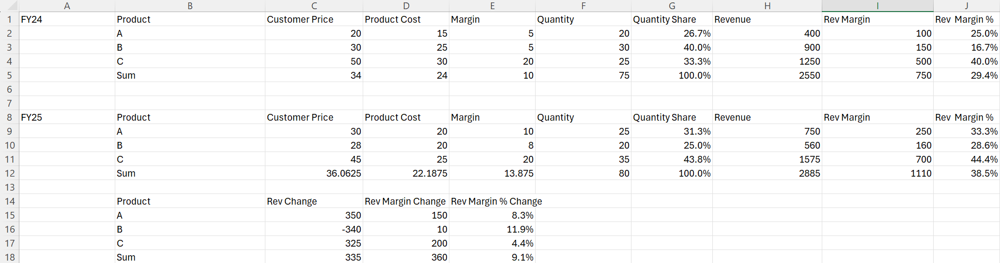

Final step before reaching FY25 actual revenue margin. Now we **add the last variable, the margin of A is changing**. How much more revenue margin can we have?

### Margin Effect

**Margin Effect** =  FY25 A Quantity (F9)  x ( FY25 A Margin (E9) - FY24 A Margin (E2) ) = 25 x (10 – 5) = 125

**(Effect from product margin change)**

Now we are 250 for product A revenue margin (FY25 actual revenue margin)

Revenue margin change is now broken into **volume development, margin change, and structure change.** In total, if there is no structure change, our total quantity from 75 to 80 brought us more revenue margin of 50 **(Volume Effect)**. Compared to this hypothetical case, our structure change brought us 125 more **(Mix Effect)**. And lastly, improving margins of A and B brought us 185 more **(Margin Effect)**.

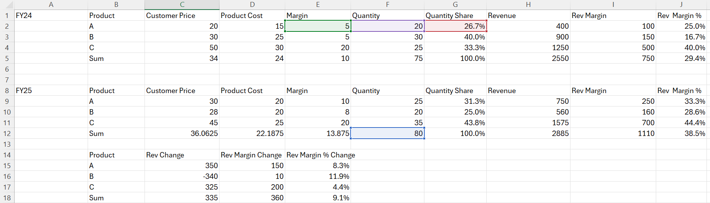

However, regarding the structure change, which products are **optimizing our business structure**, which are worth our attention? 

Mix effect just tells us about the **absolute impact from structure change**. We need **a benchmark to determine whether the structure change is favorable or not!**

If we use the **average margin** as a benchmark, we can adjust the mix effect from **absolute impact to relative impact by adding a mathematical transformation**. As you can see from the screenshot, the sum of the Structural Optimization Contribution (RM abs) is always same as sum of the mix effect. 

Take product A as an example:

### Structural Optimization Contribution (RM abs)

**Structural Optimization Contribution (RM abs)** =  ( FY25 A Quantity (F9) - FY25 Total Quantity (F12) x FY24 A Quantity Share (G2) )  x ( FY24 A Margin (E2) – FY24 AVG Margin (E5) ) = (25 – 80 x 26.7%) x (5 – 10) = -18.3333

**(Contribution to structural optimization in relation to the average margin)**

Basic principle here: **the bigger portion of quantity is with our higher-than-average margin products, the more favorable is for our business structure!**

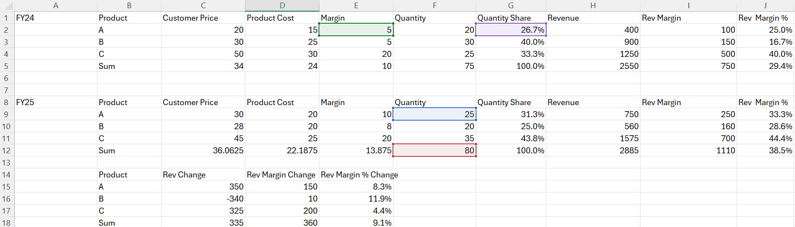

What if we use the average revenue margin rate as a benchmark? In addition to replacing the average margin with the average margin rate, we need to **add the price as a multiplier.** 

### Structural Optimization Contribution (RM %)

**Structural Optimization Contribution (RM %)** =  ( FY25 A Quantity (F9) - FY25 Total Quantity (F12) x FY24 A Quantity Share (G2) )  x ( FY24 A Margin Rate (J2) – FY24 AVG Margin Rate (J5) ) x FY24 A Price (C2) = (25 – 80 x 26.7%) x (25% – 29.4%) x 20 = -3.2353

**(Contribution to structural optimization in relation to the average margin rate)**

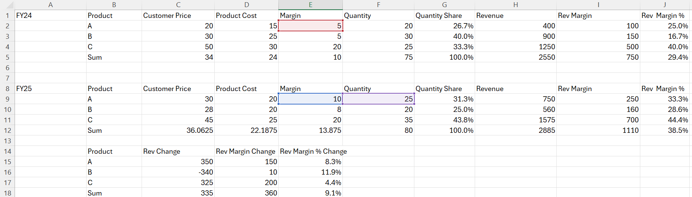

As we can see, two benchmarks give different results. Let's look at the difference to find out why.

### Price Structure Variance

**Price Structure Variance** = ( FY25 A Quantity (F9) - FY25 Total Quantity (F12) x FY24 A Quantity Share (G2) )  x  FY24 A AVG Margin Rate (J5) x ( FY24 A Price (C2) - FY24 AVG Price (C5) ) = (25 – 80 x 26.7%) x 29.4% x ( 20 - 34) = -15.0980

From the formula, we can see that the **pricing difference** of our products is the root cause of the difference between two benchmarks' results.

However, both results are useful for us, since **improving revenue margin rate and increasing revenue margin are not exactly the same goals**. A simple example: product A is priced at 10, with a margin of 9 and a margin rate of 90%; while product B is priced at 1000, with a margin of 100 and a margin rate of 10%. In this case, we have high margin in product B but high margin rate in product A. 

Now, let's have a look at the complete results of VMM.

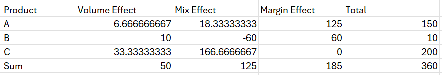

Still take product A as example, the increased revenue margin is **mainly driven by margin improvement**. And from the volume perspective, it is **growing together with the overall and even proportionally more than the overall**. This is shown in the positive **mix effect** of 18.33. Until now, everything seems fine with product A. However, when we look at both contribution KPIs, product A is showing negative results, meaning **its development is indeed worsening the overall product structure**. Why? Product A is a **low margin product in relation to the average** (25% against 29.4% on margin rate and 5 against 10 on absolute margin), so **the bigger product A's portion is, the more unfavorable it is for our business structure**. Therefore, the conclusion is that **product A has significantly improved its margin, however it is still not good enough**. We should **further work on the margin**, and strategically we should **limit the sales resource allocation to product A** until we see that significant margin improvement.

But how to improve further on product A's margin? For that we need to look at product A separately on an operational level. That's where the second perspective - **Price-Cost-Quantity Perspective (PCQ)** plays a role. In this analysis, we break the revenue margin change down to the three basic factors – **price, cost and quantity**. How? **Still by controlling variables**. 

## Price-Cost-Quantity Perspective (PCQ)

Product A has a revenue margin change of 150, which is a mixed result from price, cost and quantity changes. 

First, we **keep cost and quantity unchanged and only change the price to FY25 level**.

### Price Effect

**Price Effect** = ( FY25 A Price (C9) - FY24 A Price (C2) ) x FY24 A Quantity (F2)  = (30 – 20) x 20 =  200

**(Effect from product price change)**

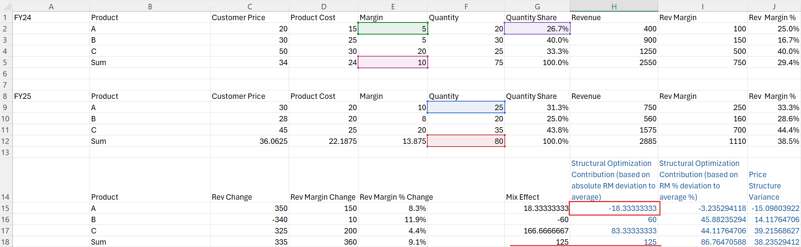

Second, we **keep price and quantity unchanged and only change the cost to FY25 level**.

### Cost Effect

**Cost Effect** = - ( FY25 A Cost (D9) - FY24 A Cost (D2) ) x FY24 A Quantity (F2)  = - (20 – 15) x 20 = -100

**(Effect from product cost change)**

Third, we **keep price and cost unchanged and only change the quantity to FY25 level**.

### Quantity Effect

**Quantity Effect** = ( FY25 A Quantity (F9) - FY24 A Quantity (F2) ) x ( FY24 A Price (C2) - FY24 A Cost (D2) )  = (25 – 20) x (20 – 15) = 25

**(Effect from product quantity change)**

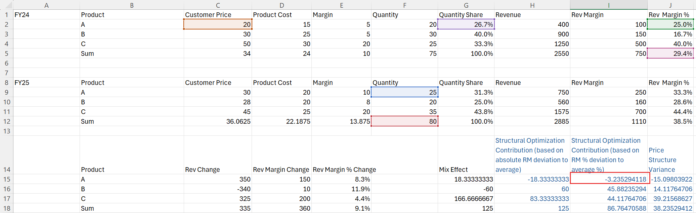

&gt; **Note:** Quantity Effect is always equal to Volume Effect + Mix Effect from VMM Perspective.

Last, since we are dealing with 3 variables, after we have done the exercises before, mathematically we will still have a remaining item. 

### Cross Term

**Cross Term** = ( FY25 A Quantity (F9) - FY24 A Quantity (F2) ) x ( ( FY25 A Price (C9) - FY24 A Price (C2) )  - ( FY25 A Cost (D9) - FY24 A Cost (D2) ) ) = (25 – 20) x ( (30 – 20) - (20 – 15) ) = 25

**(Part of changed revenue margin from additional quantity with additional price-cost margin)**

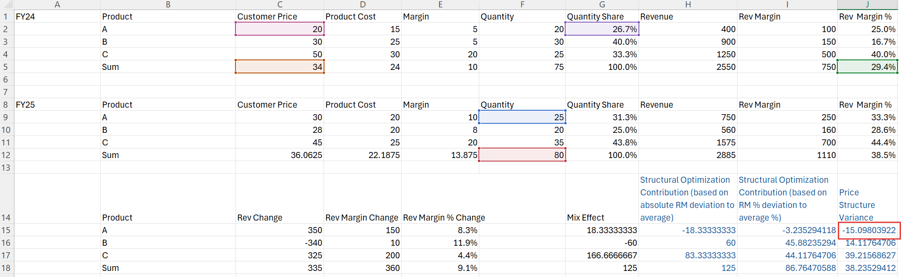

Now, let's look at the complete results of PCQ.

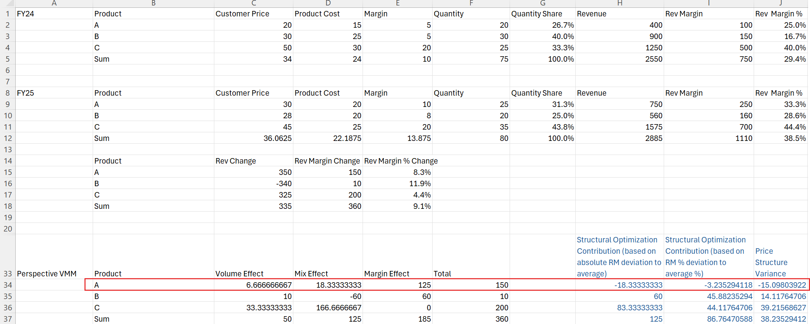

As we can see, product A has significantly increased in price and cost at the same time, although margin per unit has improved. Therefore, back to the question from VMM, it's clear now that product A needs to work on cost reduction to achieve even higher margin.

Now, with the two perspectives combined, we have a holistic view on the performance of product A. Strategically, since product A is currently a low-margin product, until we see significant margin improvement, we should limit the sales resource allocation to product A. Operationally, product A needs to work on cost reduction aiming for higher margin.

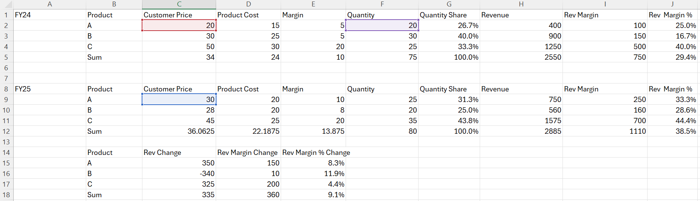

## Conclusion

This marks the end of the introduction on the revenue margin analysis framework. In this exercise, we answered the questions raised at the beginning: 

1. What are the driving factors in the revenue margin change? 
2. What is the product mix effect and how has each product performed with regards to the product mix? 
3. Looking at each product itself, how has it performed at an operational level? 

I hope you now have a different understanding of how to analyze the product complex with regard to its revenue margin development. And you should definitely try this idea for other similar topics of your real job.

---

## 📊 Additional Resources

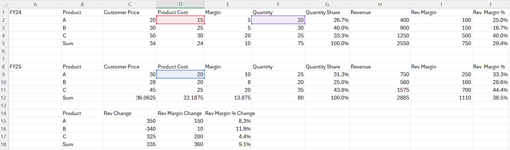

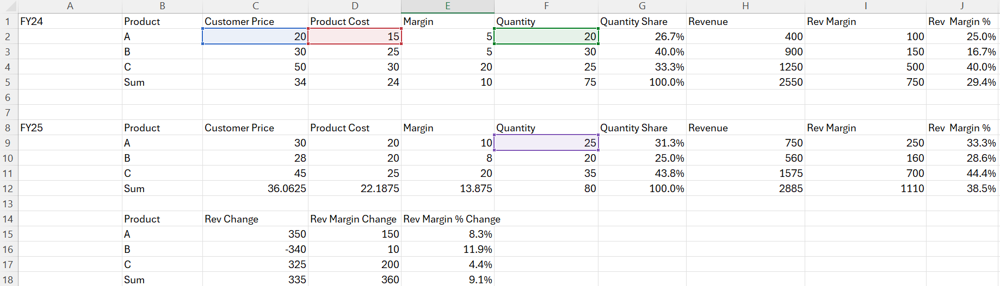

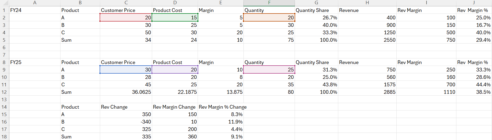

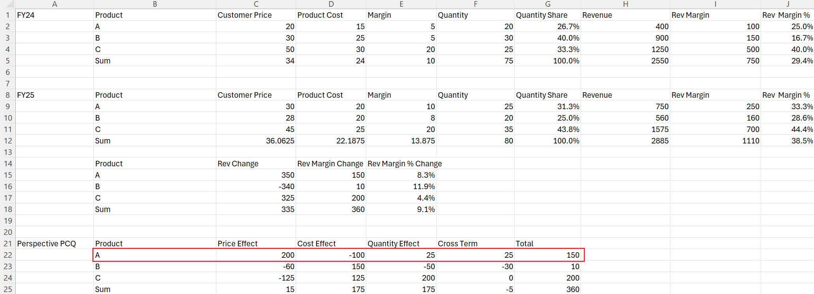
